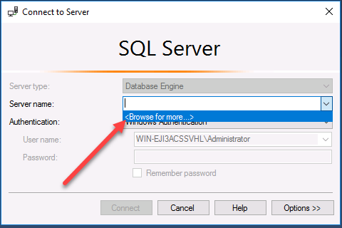
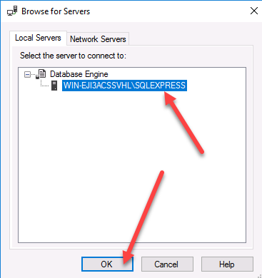
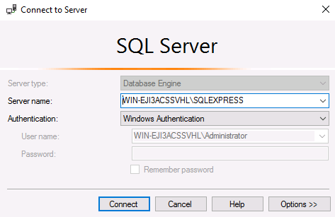
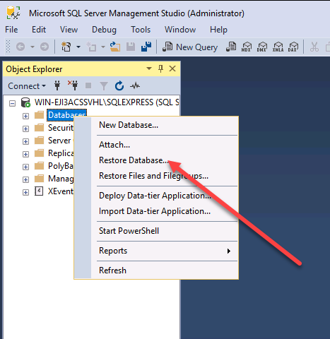
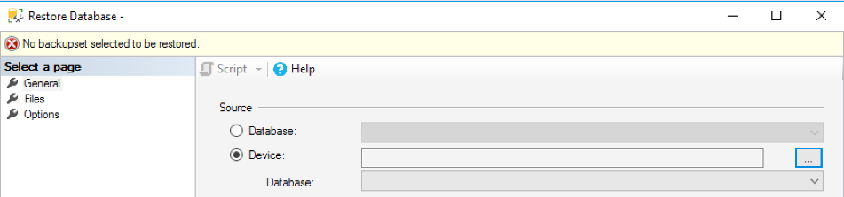
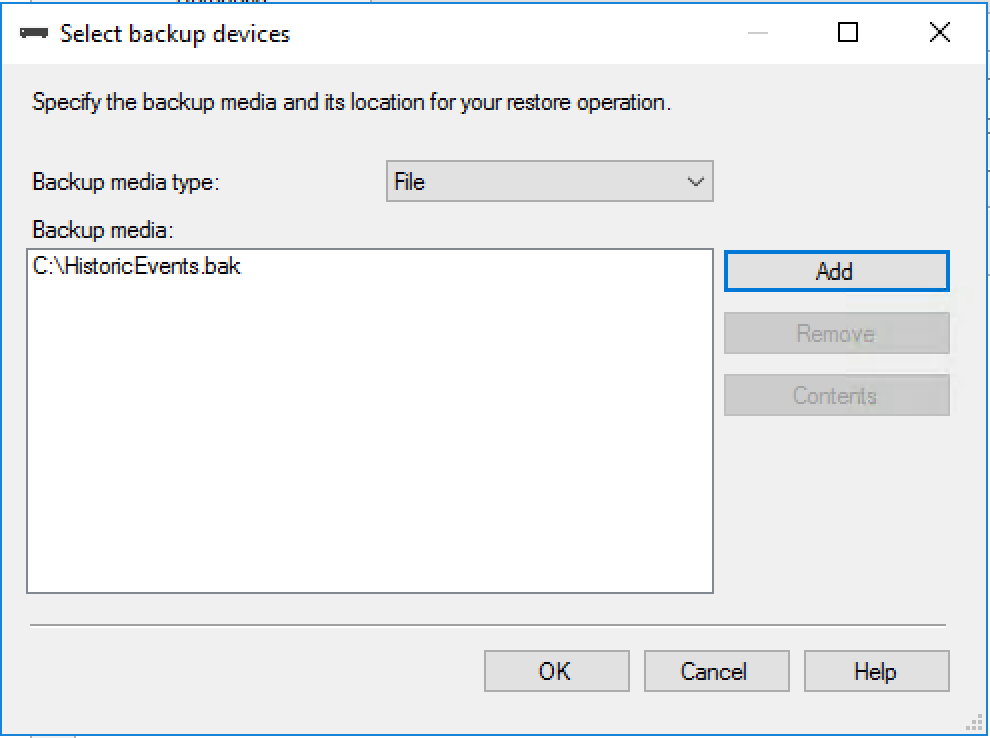
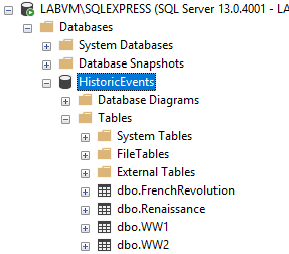


# Proof of Concept

# Overview

In this proof of concept (PoC) you will take an existing legacy .NET
application (explained below) and "containerize" it. This approach is
commonly known as lift and shift as you are not required to make any
design changes to the existing application. The following sections
describe the existing application design and approach you may want to
take to containerize it.

Please do keep in mind that there are multiple ways to containerize the
existing application. The goal is to try to containerize it yourself
without any assistance based on knowledge gained during the education
sessions. You can work with a partner/group or work on your own, it's up
to you\!

# Problem Statement

You are a developer consultant helping the Kent County Public School
District to containerize their history teaching application. They want
to use containers because developers are always arguing over the
application "working just fine on my machine" when changes are pushed,
however the application is constantly breaking on different
environments. Also, the method for deploying each application to
production is different, and they want a nice way to streamline
deploying all their various apps.

The application displays historical events that were saved in the
database based on a certain time-period in history (Renaissance, French
Revolution, WWI, and WWII). There is one .NET web app solution with an
associated SQL database for its data. They also hand you a Database
folder that has a "import-json-files-to-tables" so you can import their
data and connect to it with the application. The Database folder also
holds a JSON file with the frenchrevolution, renaissance, wwi, and ww2
content.

## Prerequisite  

Prerequisite Software (all already installed on lab VM)

-  Visual Studio 2017

-  Windows Container support

-  Docker Engine and Docker CLI

-  Microsoft SQL Server 17 Management Studio

-  Microsoft SQL Server 2017 SP1 Express

# Tasks

1.  Test out that your application works locally with the database first, you should always make sure the application works locally before throwing it into a container. Get the database working with the data. Get the application connected to the local database with their data. The steps to restore the database will be provided below under the section titled "Legacy Application Setup & Walkthrough".

2.  In the containerization phase, you need to create two Dockerfiles: One for ASP .NET web application and other for the SQL server. You can ask instructor(s) for assistance while doing through the process of creating these files.

  *Note: The School District would like you to use this base image     for their web app: **microsoft/iis** and this base image for     their SQL database: **microsoft/mssql-server-windows-express**.     They would like you to utilize Dockerfiles (one for their web     app, one for their database).*

3.  The application files are on your Windows LOD VM under **C:\PoC**. Additionally, they are also accessible for download on the GitHub repository [Microsoft/WorkshopPLUS-Developing-Applications-with-Containers](https://github.com/Microsoft/WorkshopPLUS-Developing-Applications-with-Containers) where the folder **PoC** can be extracted on your Windows machine to complete this exercise.  
4.  Create a **docker-compose.yml** file that will run both of your Dockerfiles. If you did it correctly, you should be able to run the ` docker-compose.exe up -d` command and see the application working with the database\!

# Legacy Application Setup & Walkthrough

## Restore Database

First, you need to restore the application database provided to you. The
name of database file is **HistoricEvents.bak**. Please follow the steps
below to restore the database.

1.  Open SQL Server Management Studio, it is pinned to your taskbar  
   
2.  Click Server Name and select '\<Browse for more\>'  
  
3.  Click the **+** sign under Database Engine and choose the only option there, then hit **OK**.  
   
4.  Choose **Windows Authentication** and then hit **Connect**  
   
5.  From the Object Explorer right click the **Databases** and select **Restore Database**.   
   
6.  On the **Restore Database** window select the **Device** option and then press **"..."** button next to it.  
   
7.  On the Select backup devices option press **Add** and then select **HistoricEvents.bak** file that is provided to you. Finally press **OK**.  
   
8.  Press **OK** on the **Restore Database** window.  
   
9.  You should see a "**Database 'HistoricEvents' has restored successfully**" message. Press **OK** to close the window.  
10.  From the Object Explorer expand the **Historic Events** database and then further expand the **Tables**. You should see custom database tables.  
   
11.  You have now successfully restored the database. You may want to keep the SQL Server Management Studio open for later use.  
12.  The application files are in your Windows LOD VM under **C:\PoC**, go to this location and open the .sln file in Visual Studio.  
13.  Find the **Web.config** file and edit the **Connection String** so that it will connect to your local database. Test out the application locally.  
    
## Additional instructions  
Here are some more detailed instructions to package these two components in Docker containers. The high level steps of this POC are to:  
- Write a Dockerfile for the application and one for the database.  
  > Hint: Use **sqlcmd** to keep the database container running  
- Build the 2 container images  
  > Use the `docker build` command. If you need to build a new image without cache, use the **--no-cache** parameter.  
- Create the **docker-compose.yml** file to describe the relationship between the application and the database.   
- Start the 2 containers with the docker compose tool    
  >`docker-compose up -d`  
- Access the website and call the database content  
  >Hint: If you don't see any data, take a closer look at the web.config  
  
    
    > If you need any help with the Dockerfiles and the compose file, you can download them here: https://tinyurl.com/POC-Dockerfiles. Once you have these files, you need to understand how to use them. 